# 🔍 ML-Homicidios

**Sistema de Machine Learning para Predicción de Tasas de Homicidios en Colombia**

[](https://www.python.org/downloads/)
[](https://streamlit.io/)
[](https://www.docker.com/)
[](LICENSE)

---

## 📋 Descripción

ML-Homicidios es un sistema completo de Machine Learning containerizado que predice tasas de homicidios en Colombia a nivel de:
- 🏛️ **Departamento**
- 🏙️ **Municipio**
- 📍 **Zona**
- 🏘️ **Tipo de Municipio**

El sistema extrae automáticamente datos de la **API de Datos Abiertos de Colombia**, los procesa a través de un pipeline ETL hacia un Data Lake y Data Warehouse, entrena modelos de ML, y sirve predicciones a través de un dashboard interactivo de Streamlit.

---

## 🎯 Objetivos del Proyecto

1. **Aprendizaje**: Desarrollar habilidades en ingeniería de datos y ML en producción
2. **Predicción**: Generar predicciones precisas de tasas de homicidios
3. **Visualización**: Proporcionar insights accionables a través de dashboards interactivos
4. **Automatización**: Pipeline completamente automatizado con cron jobs

---

## 🏗️ Arquitectura

```mermaid
graph TB
    subgraph "Capa de Ingesta"
        A[API Datos Abiertos] -->|Cron Diario| B[Extractor de Datos]
        B --> C[Data Lake - Raw]
    end
    
    subgraph "Capa de Procesamiento"
        C --> D[Pipeline ETL]
        D --> E[Data Warehouse]
    end
    
    subgraph "Capa de ML"
        E --> F[Feature Engineering]
        F --> G[Entrenamiento]
        G --> H[Modelos Entrenados]
    end
    
    subgraph "Capa de Aplicación"
        H --> I[Dashboard Streamlit]
        E --> I
        I --> J[Streamlit Cloud]
    end
    
    style A fill:#e1f5ff
    style J fill:#ffe1f5
```



---

## 🛠️ Stack Tecnológico

### Core
- **Python 3.11+**: Lenguaje principal
- **Docker & Docker Compose**: Containerización
- **Git**: Control de versiones

### Data Pipeline
- **Requests & Sodapy**: Extracción de datos de APIs
- **Pandas & Polars**: Manipulación de datos
- **Parquet**: Almacenamiento eficiente (Data Lake)
- **Python-Crontab**: Automatización de tareas

### Machine Learning
- **Scikit-learn**: Algoritmos base y preprocessing
- **XGBoost & LightGBM**: Gradient boosting
- **Prophet**: Forecasting de series temporales
- **MLflow**: Tracking de experimentos (opcional)

### Visualización
- **Streamlit**: Framework de dashboard
- **Plotly**: Gráficos interactivos
- **Folium & GeoPandas**: Mapas de Colombia

### Testing & Quality
- **Pytest**: Framework de testing
- **Black, Flake8, Isort**: Code quality
- **MyPy**: Type checking

---

## 📁 Estructura del Proyecto

```
ML-Homicidios/
├── 📂 data/
│   ├── raw/              # Data Lake - Datos crudos
│   ├── processed/        # Data Warehouse - Datos procesados
│   └── models/           # Modelos entrenados
├── 📂 src/
│   ├── config/           # Configuración centralizada
│   ├── data_ingestion/   # Cliente API y scheduler
│   ├── etl/              # Pipeline ETL
│   ├── features/         # Ingeniería de features
│   ├── models/           # Entrenamiento y predicción
│   └── utils/            # Utilidades y logging
├── 📂 app/
│   ├── streamlit_app.py  # Dashboard principal
│   ├── pages/            # Páginas del dashboard
│   └── components/       # Componentes reutilizables
├── 📂 notebooks/         # Análisis exploratorio
├── 📂 tests/             # Pruebas unitarias
├── 📂 docker/            # Configuración Docker
├── 📄 requirements.txt   # Dependencias Python
├── 📄 docker-compose.yml # Orquestación de servicios
└── 📄 README.md          # Este archivo
```

---

## 🚀 Instalación y Configuración

### Prerrequisitos

- Python 3.11 o superior
- Docker & Docker Compose (opcional, para containerización)
- Git

### 1. Clonar el Repositorio

```bash
git clone https://github.com/tu-usuario/ML-Homicidios.git
cd ML-Homicidios
```

### 2. Configurar Entorno Virtual

```bash
# Crear entorno virtual
python -m venv venv

# Activar entorno virtual
# Windows (Git Bash)
source venv/Scripts/activate

# Linux/Mac
source venv/bin/activate
```

### 3. Instalar Dependencias

```bash
pip install -r requirements.txt
```

### 4. Configurar Variables de Entorno

```bash
# Copiar template de variables de entorno
cp .env.example .env

# Editar .env con tus credenciales
nano .env
```

**Variables requeridas en `.env`:**
```env
# API Datos Abiertos
DATOS_ABIERTOS_API_KEY=tu_api_key_aqui
DATOS_ABIERTOS_DATASET_ID=dataset_id_aqui

# Database (opcional)
DB_HOST=localhost
DB_PORT=5432
DB_NAME=homicidios_db
DB_USER=usuario
DB_PASSWORD=contraseña

# Paths
DATA_RAW_PATH=./data/raw
DATA_PROCESSED_PATH=./data/processed
MODELS_PATH=./data/models

# Logging
LOG_LEVEL=INFO
```

---

## 📊 Uso

### Opción 1: Ejecución Local

#### Extraer Datos

```bash
# Ejecutar extracción manual de datos
python -m src.data_ingestion.api_client
```

#### Ejecutar Pipeline ETL

```bash
# Procesar datos crudos
python -m src.etl.extract
python -m src.etl.transform
python -m src.etl.load
```

#### Entrenar Modelos

```bash
# Entrenar todos los modelos
python -m src.models.train

# Evaluar modelos
python -m src.models.evaluate
```

#### Lanzar Dashboard

```bash
# Iniciar aplicación Streamlit
streamlit run app/streamlit_app.py
```

### Opción 2: Docker Compose

```bash
# Construir y levantar todos los servicios
docker-compose up --build

# Ejecutar en background
docker-compose up -d

# Ver logs
docker-compose logs -f

# Detener servicios
docker-compose down
```

---

## 🧪 Testing

```bash
# Ejecutar todos los tests
pytest tests/ -v

# Con cobertura
pytest tests/ --cov=src --cov-report=html

# Tests específicos
pytest tests/test_etl.py -v
```

---

## 📈 Pipeline de Datos

### 1. Extracción (Extract)
- Conexión a API de Datos Abiertos
- Descarga de datos de homicidios
- Almacenamiento en Data Lake (Parquet)

### 2. Transformación (Transform)
- Limpieza de datos
- Estandarización de ubicaciones
- Agregaciones por nivel geográfico
- Generación de features temporales

### 3. Carga (Load)
- Almacenamiento en Data Warehouse
- Versionado de datos
- Validación de calidad

### 4. Automatización
- Cron job diario para extracción
- Reentrenamiento semanal de modelos
- Actualización automática de predicciones

---

## 🤖 Modelos de Machine Learning

### Modelos Implementados

1. **Modelo por Departamento**
   - Predicción de tasas a nivel departamental
   - Features: históricos, estacionalidad, tendencias

2. **Modelo por Municipio**
   - Predicción granular por municipio
   - Features: población, tipo, departamento

3. **Modelo por Zona**
   - Predicción por zona geográfica
   - Features: urbano/rural, características socioeconómicas

4. **Modelo por Tipo de Municipio**
   - Clasificación y predicción por tipo
   - Features: categorización, patrones históricos

### Algoritmos Utilizados
- **XGBoost**: Gradient boosting optimizado
- **LightGBM**: Alternativa rápida y eficiente
- **Prophet**: Series temporales
- **Scikit-learn**: Baseline y preprocessing

### Métricas de Evaluación
- **RMSE** (Root Mean Square Error)
- **MAE** (Mean Absolute Error)
- **R²** (Coefficient of Determination)
- **MAPE** (Mean Absolute Percentage Error)

---

## 📱 Dashboard Streamlit

### Páginas Disponibles

#### 🏠 Home
- Resumen ejecutivo
- Estadísticas clave
- Mapa interactivo de Colombia

#### 📊 Análisis Exploratorio (EDA)
- Distribuciones de homicidios
- Tendencias temporales
- Análisis por región

#### 🤖 Predicciones
- Interfaz de predicción interactiva
- Selección de ubicación y horizonte
- Intervalos de confianza
- Visualización de resultados

#### 📈 Tendencias
- Análisis histórico
- Patrones estacionales
- Comparativas regionales

---

## 🔧 Comandos Útiles (Makefile)

```bash
# Setup inicial
make setup

# Ejecutar pipeline completo
make pipeline

# Entrenar modelos
make train

# Ejecutar tests
make test

# Limpiar archivos temporales
make clean

# Formatear código
make format

# Linting
make lint
```

---

## 📝 Roadmap

### Fase 1: Fundación ✅
- [x] Estructura del proyecto
- [x] Configuración de dependencias
- [x] README y documentación

### Fase 2: Pipeline de Datos 🚧
- [ ] Cliente API Datos Abiertos
- [ ] Pipeline ETL
- [ ] Data Lake y Warehouse
- [ ] Cron jobs

### Fase 3: Machine Learning 📅
- [ ] EDA y análisis
- [ ] Feature engineering
- [ ] Entrenamiento de modelos
- [ ] Evaluación y selección

### Fase 4: Dashboard 📅
- [ ] Aplicación Streamlit
- [ ] Visualizaciones
- [ ] Interfaz de predicciones

### Fase 5: Deployment 📅
- [ ] Docker containers
- [ ] Streamlit Cloud
- [ ] CI/CD
- [ ] Documentación final

---

## 🤝 Contribución

Este es un proyecto de aprendizaje. Si tienes sugerencias o mejoras:

1. Fork el proyecto
2. Crea una rama (`git checkout -b feature/mejora`)
3. Commit tus cambios (`git commit -m 'Agregar mejora'`)
4. Push a la rama (`git push origin feature/mejora`)
5. Abre un Pull Request

---

## 📚 Recursos y Referencias

### Datos
- [Datos Abiertos Colombia](https://www.datos.gov.co/)
- [API Socrata](https://dev.socrata.com/)

### Documentación
- [Streamlit Docs](https://docs.streamlit.io/)
- [Scikit-learn](https://scikit-learn.org/)
- [XGBoost](https://xgboost.readthedocs.io/)
- [Prophet](https://facebook.github.io/prophet/)

### Tutoriales
- [Docker para Data Science](https://docker-curriculum.com/)
- [MLOps Best Practices](https://ml-ops.org/)

---

## 📄 Licencia

Este proyecto está bajo la Licencia MIT. Ver archivo `LICENSE` para más detalles.

---

## 👤 Autor

**Rai De León**

- GitHub: [@tu-usuario](https://github.com/tu-usuario)
- LinkedIn: [Tu Perfil](https://linkedin.com/in/tu-perfil)

---

## 🙏 Agradecimientos

- Datos Abiertos Colombia por proporcionar acceso a datos públicos
- Comunidad de Python y ML por las herramientas open source
- Streamlit por facilitar la creación de dashboards

---

## 📞 Contacto

¿Preguntas o sugerencias? Abre un [issue](https://github.com/tu-usuario/ML-Homicidios/issues) o contáctame directamente.

---

**⭐ Si este proyecto te resulta útil, considera darle una estrella en GitHub!**
