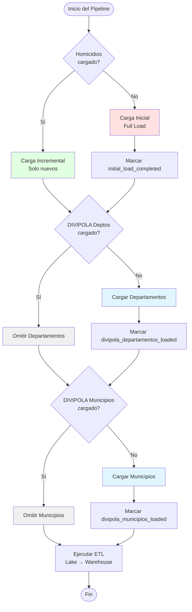

# Estrategia de Carga de Datos - ML-Homicidios

## 📊 Resumen de Estrategias por Dataset

| Dataset                    | Tipo de Carga         | Frecuencia            | Razón                               |
| -------------------------- | --------------------- | --------------------- | ----------------------------------- |
| **Homicidios**             | Inicial + Incremental | Primera vez + Viernes | Datos actualizados mensualmente     |
| **DIVIPOLA Departamentos** | Una sola vez          | Solo inicial          | Datos estáticos (raramente cambian) |
| **DIVIPOLA Municipios**    | Una sola vez          | Solo inicial          | Datos estáticos (raramente cambian) |

---

## 🔴 Dataset de Homicidios

### Carga Inicial (Full Load)

**Cuándo**: Primera ejecución del sistema

**Qué hace**:

1. Extrae **TODOS** los registros históricos de homicidios
2. Asigna ID único a cada registro (`homicidio_id`)
3. Guarda en Data Lake como Parquet
4. Marca `initial_load_completed = True`

**Código de ejemplo**:

```python
if not settings.initial_load_completed:
    # Extraer todos los datos históricos
    all_data = api_client.fetch_all_homicides()
    # Asignar IDs únicos
    all_data['homicidio_id'] = range(1, len(all_data) + 1)
    # Guardar en Data Lake
    all_data.to_parquet('data/raw/homicidios_full.parquet')
    # Actualizar flag
    update_config('initial_load_completed', True)
```

### Carga Incremental

**Cuándo**: Cada viernes a las 2 AM (cron: `0 2 * * 5`)

**Por qué viernes**: Los datos se actualizan mensualmente en Datos Abiertos, pero no hay día específico. Ejecutar cada viernes garantiza capturar los datos nuevos del mes.

**Qué hace**:

1. Detecta el último registro en Data Lake (por fecha o ID)
2. Extrae solo registros más recientes que el último
3. Asigna IDs únicos continuos
4. Append al archivo Parquet existente

**Código de ejemplo**:

```python
# Leer último registro del Data Lake
last_record = pd.read_parquet('data/raw/homicidios_full.parquet').tail(1)
last_date = last_record['fecha'].max()
last_id = last_record['homicidio_id'].max()

# Extraer solo registros nuevos
new_data = api_client.fetch_homicides_since(last_date)

if len(new_data) > 0:
    # Asignar IDs continuos
    new_data['homicidio_id'] = range(last_id + 1, last_id + len(new_data) + 1)

    # Append al Data Lake
    existing_data = pd.read_parquet('data/raw/homicidios_full.parquet')
    updated_data = pd.concat([existing_data, new_data])
    updated_data.to_parquet('data/raw/homicidios_full.parquet')
```

**Optimización**: Usar particionamiento por año/mes para cargas más eficientes:

```python
# Guardar particionado por año
new_data.to_parquet(
    'data/raw/homicidios/',
    partition_cols=['año'],
    engine='pyarrow'
)
```

---

## 🗺️ DIVIPOLA Departamentos

### Carga Única (One-Time Load)

**Cuándo**: Primera ejecución del sistema

**Por qué una sola vez**:

- Los departamentos de Colombia son **estáticos**
- Cambios son extremadamente raros (última creación: Archipiélago de San Andrés en 1991)
- No hay actualizaciones mensuales

**Qué hace**:

1. Extrae todos los departamentos de DIVIPOLA
2. Guarda en Data Lake como Parquet
3. Marca `divipola_departamentos_loaded = True`
4. **NO se vuelve a ejecutar** a menos que se resetee el flag

**Código de ejemplo**:

```python
if not settings.divipola_departamentos_loaded:
    # Extraer DIVIPOLA Departamentos
    departamentos = api_client.fetch_divipola_departamentos()

    # Guardar en Data Lake
    departamentos.to_parquet('data/raw/divipola_departamentos.parquet')

    # Marcar como cargado
    update_config('divipola_departamentos_loaded', True)

    print(f"✅ DIVIPOLA Departamentos cargado: {len(departamentos)} registros")
else:
    print("ℹ️  DIVIPOLA Departamentos ya está cargado, omitiendo...")
```

**Contenido esperado**:

- ~33 departamentos + Bogotá D.C.
- Código DANE (2 dígitos)
- Nombre oficial
- Región geográfica
- Capital

---

## 🏘️ DIVIPOLA Municipios

### Carga Única (One-Time Load)

**Cuándo**: Primera ejecución del sistema

**Por qué una sola vez**:

- Los municipios cambian muy raramente
- Última creación de municipio: 2007 (Belén de Bajirá)
- Cambios de categoría son poco frecuentes

**Qué hace**:

1. Extrae todos los municipios de DIVIPOLA
2. Guarda en Data Lake como Parquet
3. Marca `divipola_municipios_loaded = True`
4. **NO se vuelve a ejecutar** a menos que se resetee el flag

**Código de ejemplo**:

```python
if not settings.divipola_municipios_loaded:
    # Extraer DIVIPOLA Municipios
    municipios = api_client.fetch_divipola_municipios()

    # Guardar en Data Lake
    municipios.to_parquet('data/raw/divipola_municipios.parquet')

    # Marcar como cargado
    update_config('divipola_municipios_loaded', True)

    print(f"✅ DIVIPOLA Municipios cargado: {len(municipios)} registros")
else:
    print("ℹ️  DIVIPOLA Municipios ya está cargado, omitiendo...")
```

**Contenido esperado**:

- ~1,100 municipios
- Código DANE (5 dígitos)
- Nombre oficial
- Código departamento
- Categoría (Especial, 1-6)
- Tipo (urbano/rural)
- Población

---

## 🔄 Flujo Completo del Pipeline



---

## 🛠️ Mantenimiento y Actualizaciones

### Cuándo Actualizar DIVIPOLA

Solo necesitas actualizar DIVIPOLA si:

1. **Se crea un nuevo municipio** (muy raro, ~cada 10-20 años)
2. **Cambios en categorías** de municipios
3. **Actualización de población** (censo cada 10 años)
4. **Correcciones oficiales** del DANE

### Cómo Forzar Recarga de DIVIPOLA

Si necesitas recargar DIVIPOLA:

```bash
# Opción 1: Editar .env
DIVIPOLA_DEPARTAMENTOS_LOADED=False
DIVIPOLA_MUNICIPIOS_LOADED=False

# Opción 2: Eliminar archivos del Data Lake
rm data/raw/divipola_departamentos.parquet
rm data/raw/divipola_municipios.parquet

# Opción 3: Script de reset
python scripts/reset_divipola.py
```

---

## 📊 Estimación de Datos

### Tamaño Esperado en Data Lake

| Dataset                  | Registros  | Tamaño Aprox. | Frecuencia |
| ------------------------ | ---------- | ------------- | ---------- |
| Homicidios (histórico)   | ~300,000   | ~50 MB        | Una vez    |
| Homicidios (incremental) | ~1,000/mes | ~200 KB/mes   | Semanal    |
| DIVIPOLA Departamentos   | ~33        | ~10 KB        | Una vez    |
| DIVIPOLA Municipios      | ~1,100     | ~100 KB       | Una vez    |

### Crecimiento Anual

- **Homicidios**: ~12 MB/año (asumiendo ~12,000 registros/año)
- **DIVIPOLA**: 0 MB (sin cambios esperados)

---

## 🎯 Beneficios de Esta Estrategia

### Eficiencia

- ✅ **Menos llamadas a la API**: DIVIPOLA solo se carga una vez
- ✅ **Menor tiempo de ejecución**: Cron job solo procesa datos nuevos
- ✅ **Menor uso de recursos**: No re-procesar datos estáticos

### Confiabilidad

- ✅ **Datos consistentes**: DIVIPOLA no cambia entre ejecuciones
- ✅ **Joins estables**: Códigos DANE permanecen constantes
- ✅ **Auditoría clara**: Sabemos cuándo se cargó cada dataset

### Mantenibilidad

- ✅ **Fácil debugging**: Flags claros de qué está cargado
- ✅ **Recuperación simple**: Resetear flags para recargar
- ✅ **Logs informativos**: Mensajes claros de qué se omite
