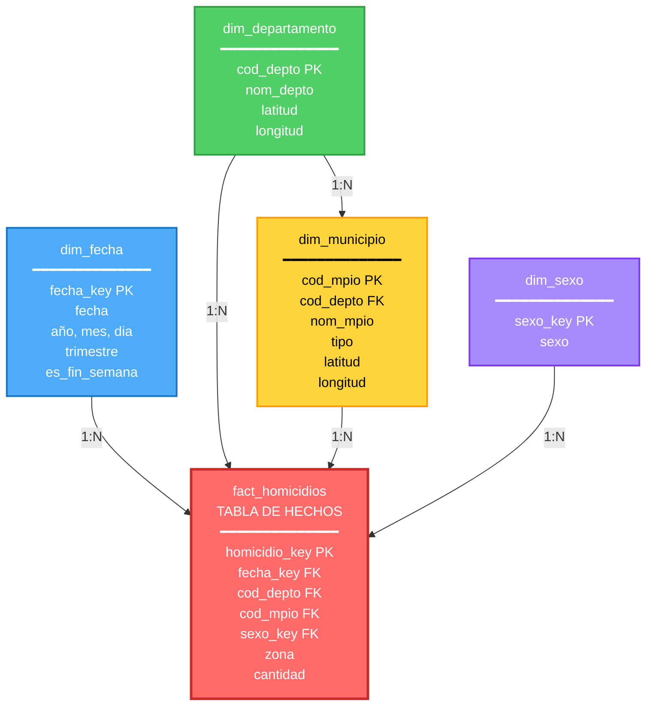

# 📊 Diagrama Entidad-Relación - Data Warehouse

## ⭐ Modelo Estrella - Homicidios Colombia

### **Diagrama Visual (Estrella)**

```
                    ┌─────────────────────────┐
                    │      dim_fecha          │
                    │   ┌─────────────────┐   │
                    │   │ fecha_key (PK)  │   │
                    │   │ fecha           │   │
                    │   │ año, mes, dia   │   │
                    │   │ trimestre       │   │
                    │   │ es_fin_semana   │   │
                    │   └─────────────────┘   │
                    └───────────┬─────────────┘
                                │
                                │ 1:N
                                │
┌──────────────────────┐        │        ┌──────────────────────┐
│  dim_departamento    │        │        │     dim_sexo         │
│ ┌──────────────────┐ │        │        │ ┌──────────────────┐ │
│ │ cod_depto (PK)   │ │        │        │ │ sexo_key (PK)    │ │
│ │ nom_depto        │ │        │        │ │ sexo             │ │
│ │ latitud          │ │        │        │ └──────────────────┘ │
│ │ longitud         │ │        │        └──────────┬───────────┘
│ └──────────────────┘ │        │                   │
└──────────┬───────────┘        │                   │ 1:N
           │                    │                   │
           │ 1:N                │                   │
           │                    │                   │
           │         ┌──────────▼───────────┐       │
           │         │                      │       │
           └────────►│  fact_homicidios     │◄──────┘
                     │  ┌────────────────┐  │
                     │  │ homicidio_key  │  │
                     │  │ fecha_key (FK) │  │
                     │  │ cod_depto (FK) │  │
                     │  │ cod_mpio (FK)  │  │
                     │  │ sexo_key (FK)  │  │
                     │  │ zona           │  │
                     │  │ cantidad       │  │
                     │  └────────────────┘  │
           ┌────────►│                      │
           │         └──────────────────────┘
           │ 1:N
           │
┌──────────┴───────────┐
│   dim_municipio      │
│ ┌──────────────────┐ │
│ │ cod_mpio (PK)    │ │
│ │ cod_depto (FK)   │ │
│ │ nom_mpio         │ │
│ │ tipo             │ │
│ │ latitud          │ │
│ │ longitud         │ │
│ └──────────────────┘ │
└──────────────────────┘
```

### **Nota:** 
- `dim_municipio` tiene FK a `dim_departamento` (jerarquía geográfica)
- Esto hace el modelo **híbrido** (estrella + snowflake)

---

## 📐 Diagrama Mermaid (Interactivo)



**Leyenda:**
- 🔴 **Rojo**: Tabla de Hechos (centro)
- 🔵 **Azul**: Dimensión Temporal
- 🟢 **Verde**: Dimensión Geográfica (Departamento)
- 🟡 **Amarillo**: Dimensión Geográfica (Municipio)
- 🟣 **Morado**: Dimensión Demográfica

---

---

## 🔑 Relaciones

### **1. Dimensiones → Hechos (1:N)**

| Dimensión | Cardinalidad | Tabla de Hechos |
|-----------|--------------|-----------------|
| `dim_fecha` | 1:N | `fact_homicidios` |
| `dim_departamento` | 1:N | `fact_homicidios` |
| `dim_municipio` | 1:N | `fact_homicidios` |
| `dim_sexo` | 1:N | `fact_homicidios` |

### **2. Jerarquía Geográfica (1:N)**

```
dim_departamento (1) ──── (N) dim_municipio
```

Un departamento tiene muchos municipios.

---

## 📐 Diagrama Simplificado

```
┌─────────────────┐
│   dim_fecha     │
│  (fecha_key)    │
└────────┬────────┘
         │
         │ 1:N
         │
┌────────▼────────────────────────────────────┐
│                                             │
│         fact_homicidios                     │
│  ┌──────────────────────────────────┐      │
│  │ homicidio_key (PK)               │      │
│  │ fecha_key (FK)                   │      │
│  │ cod_depto (FK) ──────────┐       │      │
│  │ cod_mpio (FK) ────┐      │       │      │
│  │ sexo_key (FK)     │      │       │      │
│  │ zona              │      │       │      │
│  │ cantidad          │      │       │      │
│  └───────────────────┼──────┼───────┘      │
│                      │      │              │
└──────────────────────┼──────┼──────────────┘
                       │      │
                       │      │ 1:N
                       │      │
              ┌────────▼──────┴────┐
              │  dim_departamento  │
              │   (cod_depto)      │
              └────────┬───────────┘
                       │
                       │ 1:N
                       │
              ┌────────▼───────────┐
              │   dim_municipio    │
              │   (cod_mpio)       │
              │   cod_depto (FK)   │
              └────────────────────┘

┌─────────────────┐
│    dim_sexo     │
│   (sexo_key)    │
└────────┬────────┘
         │
         │ 1:N
         │
         └──────────► fact_homicidios
```

---

## 🗂️ Tipos de Relaciones

### **Relaciones Directas (Modelo Estrella)**
- ✅ `dim_fecha` → `fact_homicidios`
- ✅ `dim_sexo` → `fact_homicidios`
- ✅ `dim_departamento` → `fact_homicidios`
- ✅ `dim_municipio` → `fact_homicidios`

### **Relación Jerárquica (Snowflake)**
- ✅ `dim_departamento` → `dim_municipio` → `fact_homicidios`

**Nota:** Este es un **modelo híbrido** (estrella + snowflake) porque:
- Las dimensiones fecha y sexo son **estrella pura** (desnormalizadas)
- La geografía es **snowflake** (normalizada con jerarquía)

---

## 📊 Cardinalidades Detalladas

```
dim_fecha (1) ──────────── (N) fact_homicidios
  ~7,000 fechas              ~332,000 homicidios
  (20 años)                  (múltiples por fecha)

dim_departamento (1) ────── (N) fact_homicidios
  33 departamentos           ~332,000 homicidios
                             (~10,000 por depto)

dim_departamento (1) ────── (N) dim_municipio
  33 departamentos           1,121 municipios
                             (~34 por depto)

dim_municipio (1) ────────── (N) fact_homicidios
  1,121 municipios           ~332,000 homicidios
                             (~296 por municipio)

dim_sexo (1) ──────────────── (N) fact_homicidios
  3 valores                  ~332,000 homicidios
  (Hombre, Mujer, No Reporta) (~110,000 por sexo)
```

---

## 🔍 Queries Típicos

### **Query 1: Homicidios por Departamento y Año**
```sql
SELECT 
    d.nom_depto,
    f.año,
    COUNT(*) as total
FROM fact_homicidios h
JOIN dim_departamento d ON h.cod_depto = d.cod_depto
JOIN dim_fecha f ON h.fecha_key = f.fecha_key
GROUP BY d.nom_depto, f.año
ORDER BY total DESC;
```
**JOINs:** 2 (dim_departamento, dim_fecha)

### **Query 2: Homicidios por Municipio (con Departamento)**
```sql
SELECT 
    d.nom_depto,
    m.nom_mpio,
    COUNT(*) as total
FROM fact_homicidios h
JOIN dim_municipio m ON h.cod_mpio = m.cod_mpio
JOIN dim_departamento d ON m.cod_depto = d.cod_depto
GROUP BY d.nom_depto, m.nom_mpio
ORDER BY total DESC;
```
**JOINs:** 2 (dim_municipio, dim_departamento via jerarquía)

### **Query 3: Análisis Completo**
```sql
SELECT 
    f.año,
    f.mes,
    d.nom_depto,
    m.nom_mpio,
    s.sexo,
    h.zona,
    SUM(h.cantidad) as total_victimas
FROM fact_homicidios h
JOIN dim_fecha f ON h.fecha_key = f.fecha_key
JOIN dim_departamento d ON h.cod_depto = d.cod_depto
JOIN dim_municipio m ON h.cod_mpio = m.cod_mpio
JOIN dim_sexo s ON h.sexo_key = s.sexo_key
GROUP BY f.año, f.mes, d.nom_depto, m.nom_mpio, s.sexo, h.zona;
```
**JOINs:** 4 (todas las dimensiones)

---

## 🎯 Ventajas de esta Arquitectura

1. ✅ **Natural Keys**: `cod_depto` y `cod_mpio` son estables y significativos
2. ✅ **Jerarquía Explícita**: Municipio → Departamento bien definida
3. ✅ **Normalización Geográfica**: No duplica info de departamentos
4. ✅ **Flexibilidad**: Fácil agregar regiones/zonas en el futuro
5. ✅ **Performance**: Índices optimizados para queries comunes
6. ✅ **Integridad**: Foreign keys garantizan consistencia

---

## 📈 Métricas del Modelo

| Métrica | Valor |
|---------|-------|
| **Dimensiones** | 4 (fecha, depto, mpio, sexo) |
| **Tablas de Hechos** | 1 (fact_homicidios) |
| **Relaciones 1:N** | 5 |
| **Índices** | 15+ |
| **Vistas** | 4 |
| **Tipo de Modelo** | Híbrido (Estrella + Snowflake) |

---

## 🔄 Flujo de Datos

```
Data Lake (Raw)
    │
    │ ETL
    ▼
┌─────────────────────────────────┐
│  Dimensiones (DIVIPOLA)         │
│  - dim_departamento              │
│  - dim_municipio                 │
└─────────────────────────────────┘
    │
    │ Lookup
    ▼
┌─────────────────────────────────┐
│  Tabla de Hechos                │
│  - fact_homicidios               │
│    (con FKs a dimensiones)       │
└─────────────────────────────────┘
    │
    │ Queries
    ▼
┌─────────────────────────────────┐
│  Vistas Analíticas              │
│  - v_homicidios_por_depto       │
│  - v_homicidios_por_mpio        │
│  - v_homicidios_por_sexo        │
└─────────────────────────────────┘
```

---

¡Este es el modelo final del Data Warehouse! 🎉
