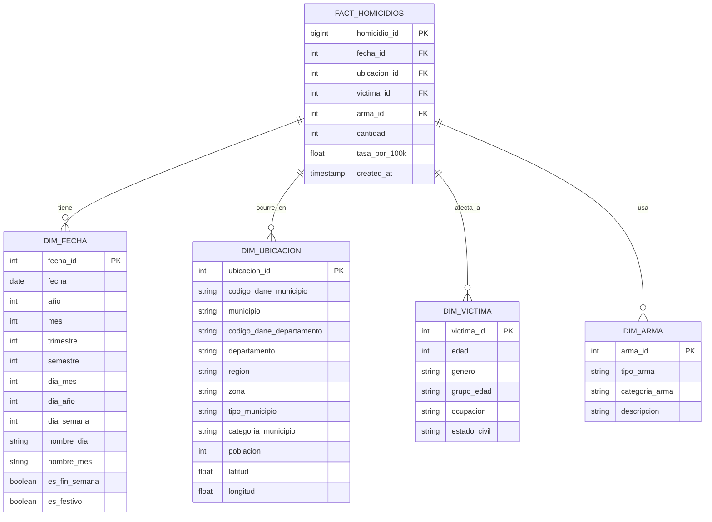
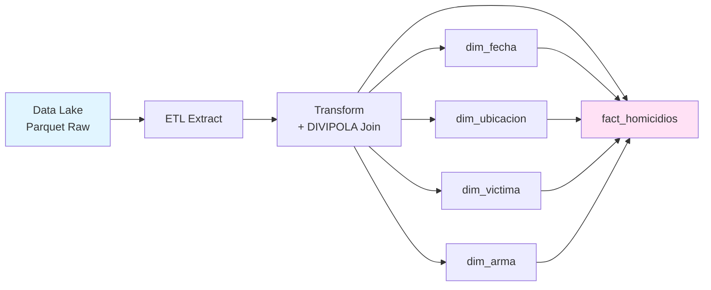

# Modelo Estrella - Data Warehouse ML-Homicidios

## 📊 Arquitectura del Data Warehouse

Este documento describe el **modelo estrella (star schema)** del Data Warehouse para el proyecto ML-Homicidios.

---

## 🌟 Diagrama del Modelo Estrella



---

## 📋 Descripción de Tablas

### 1. Tabla de Hechos: `fact_homicidios`

**Propósito**: Almacena los eventos de homicidios con referencias a las dimensiones.

| Campo           | Tipo      | Descripción                         |
| --------------- | --------- | ----------------------------------- |
| `homicidio_id`  | BIGINT    | ID único del homicidio (PK)         |
| `fecha_id`      | INT       | FK a dim_fecha                      |
| `ubicacion_id`  | INT       | FK a dim_ubicacion                  |
| `victima_id`    | INT       | FK a dim_victima                    |
| `arma_id`       | INT       | FK a dim_arma                       |
| `cantidad`      | INT       | Cantidad de víctimas (usualmente 1) |
| `tasa_por_100k` | FLOAT     | Tasa por 100,000 habitantes         |
| `created_at`    | TIMESTAMP | Fecha de carga del registro         |

**Granularidad**: Un registro por homicidio

**Métricas**:

- Cantidad de homicidios
- Tasa de homicidios por 100,000 habitantes

---

### 2. Dimensión: `dim_fecha`

**Propósito**: Dimensión temporal para análisis por tiempo.

| Campo           | Tipo        | Descripción                           |
| --------------- | ----------- | ------------------------------------- |
| `fecha_id`      | INT         | ID único (PK)                         |
| `fecha`         | DATE        | Fecha completa                        |
| `año`           | INT         | Año (2010-2024)                       |
| `mes`           | INT         | Mes (1-12)                            |
| `trimestre`     | INT         | Trimestre (1-4)                       |
| `semestre`      | INT         | Semestre (1-2)                        |
| `dia_mes`       | INT         | Día del mes (1-31)                    |
| `dia_año`       | INT         | Día del año (1-366)                   |
| `dia_semana`    | INT         | Día de la semana (1=Lunes, 7=Domingo) |
| `nombre_dia`    | VARCHAR(10) | Nombre del día                        |
| `nombre_mes`    | VARCHAR(10) | Nombre del mes                        |
| `es_fin_semana` | BOOLEAN     | Si es sábado o domingo                |
| `es_festivo`    | BOOLEAN     | Si es día festivo en Colombia         |

**Uso**: Agregaciones temporales, análisis de tendencias, estacionalidad

---

### 3. Dimensión: `dim_ubicacion`

**Propósito**: Dimensión geográfica enriquecida con DIVIPOLA.

| Campo                      | Tipo         | Descripción                              |
| -------------------------- | ------------ | ---------------------------------------- |
| `ubicacion_id`             | INT          | ID único (PK)                            |
| `codigo_dane_municipio`    | VARCHAR(5)   | Código DANE del municipio                |
| `municipio`                | VARCHAR(100) | Nombre del municipio                     |
| `codigo_dane_departamento` | VARCHAR(2)   | Código DANE del departamento             |
| `departamento`             | VARCHAR(50)  | Nombre del departamento                  |
| `region`                   | VARCHAR(50)  | Región geográfica (Andina, Caribe, etc.) |
| `zona`                     | VARCHAR(20)  | Urbana/Rural                             |
| `tipo_municipio`           | VARCHAR(50)  | Tipo según DIVIPOLA                      |
| `categoria_municipio`      | VARCHAR(20)  | Categoría (Especial, 1-6)                |
| `poblacion`                | INT          | Población estimada                       |
| `latitud`                  | FLOAT        | Coordenada latitud                       |
| `longitud`                 | FLOAT        | Coordenada longitud                      |

**Fuente**: Integración de datos de homicidios + DIVIPOLA

**Uso**: Análisis geográfico, mapas, predicciones por ubicación

---

### 4. Dimensión: `dim_victima`

**Propósito**: Características demográficas de las víctimas.

| Campo          | Tipo         | Descripción                    |
| -------------- | ------------ | ------------------------------ |
| `victima_id`   | INT          | ID único (PK)                  |
| `edad`         | INT          | Edad de la víctima             |
| `genero`       | VARCHAR(20)  | Masculino/Femenino/Otro        |
| `grupo_edad`   | VARCHAR(20)  | 0-17, 18-25, 26-40, 41-60, 60+ |
| `ocupacion`    | VARCHAR(100) | Ocupación (si disponible)      |
| `estado_civil` | VARCHAR(50)  | Estado civil (si disponible)   |

**Uso**: Análisis demográfico, perfiles de víctimas

---

### 5. Dimensión: `dim_arma`

**Propósito**: Tipo de arma utilizada en el homicidio.

| Campo            | Tipo         | Descripción                    |
| ---------------- | ------------ | ------------------------------ |
| `arma_id`        | INT          | ID único (PK)                  |
| `tipo_arma`      | VARCHAR(100) | Tipo específico de arma        |
| `categoria_arma` | VARCHAR(50)  | Arma de fuego/Arma blanca/Otro |
| `descripcion`    | TEXT         | Descripción adicional          |

**Uso**: Análisis por tipo de arma, patrones de violencia

---

## 🔄 Pipeline: Data Lake → Data Warehouse

### Flujo de Datos



### Proceso ETL

1. **Extract**: Leer datos del Data Lake (Parquet)
2. **Transform**:
   - Limpiar y estandarizar datos
   - JOIN con DIVIPOLA (departamentos y municipios)
   - Crear dimensiones (deduplicar y generar IDs)
   - Calcular métricas (tasa por 100k habitantes)
3. **Load**: Insertar en tablas del Data Warehouse

---

## 📊 Queries de Ejemplo

### Homicidios por Departamento y Año

```sql
SELECT
    u.departamento,
    f.año,
    COUNT(*) as total_homicidios,
    AVG(fh.tasa_por_100k) as tasa_promedio
FROM fact_homicidios fh
JOIN dim_ubicacion u ON fh.ubicacion_id = u.ubicacion_id
JOIN dim_fecha f ON fh.fecha_id = f.fecha_id
GROUP BY u.departamento, f.año
ORDER BY f.año DESC, total_homicidios DESC;
```

### Tendencia Mensual por Región

```sql
SELECT
    u.region,
    f.año,
    f.mes,
    COUNT(*) as total_homicidios
FROM fact_homicidios fh
JOIN dim_ubicacion u ON fh.ubicacion_id = u.ubicacion_id
JOIN dim_fecha f ON fh.fecha_id = f.fecha_id
GROUP BY u.region, f.año, f.mes
ORDER BY f.año, f.mes;
```

### Análisis por Tipo de Arma y Género

```sql
SELECT
    a.categoria_arma,
    v.genero,
    COUNT(*) as total_homicidios,
    ROUND(COUNT(*) * 100.0 / SUM(COUNT(*)) OVER(), 2) as porcentaje
FROM fact_homicidios fh
JOIN dim_arma a ON fh.arma_id = a.arma_id
JOIN dim_victima v ON fh.victima_id = v.victima_id
GROUP BY a.categoria_arma, v.genero
ORDER BY total_homicidios DESC;
```

---

## 🎯 Beneficios del Modelo Estrella

### Para Análisis

- ✅ **Queries simples**: JOINs directos desde la tabla de hechos
- ✅ **Performance**: Optimizado para agregaciones
- ✅ **Intuitivo**: Fácil de entender y usar

### Para Machine Learning

- ✅ **Features listas**: Dimensiones son features naturales
- ✅ **Agregaciones rápidas**: Calcular estadísticas por grupo
- ✅ **Escalable**: Fácil agregar nuevas dimensiones

### Para BI/Dashboards

- ✅ **Compatible con herramientas BI**: Power BI, Tableau, Looker
- ✅ **Drill-down natural**: De año → mes → día
- ✅ **Filtros eficientes**: Por cualquier dimensión

---

## 🔧 Implementación Técnica

### Tecnologías Sugeridas

- **SQLite** (desarrollo): Rápido, sin servidor
- **PostgreSQL** (producción): Robusto, escalable
- **Parquet** (Data Lake): Eficiente, columnar

### Índices Recomendados

```sql
-- Tabla de hechos
CREATE INDEX idx_fact_fecha ON fact_homicidios(fecha_id);
CREATE INDEX idx_fact_ubicacion ON fact_homicidios(ubicacion_id);
CREATE INDEX idx_fact_victima ON fact_homicidios(victima_id);
CREATE INDEX idx_fact_arma ON fact_homicidios(arma_id);

-- Dimensión ubicación
CREATE INDEX idx_dim_ubicacion_depto ON dim_ubicacion(codigo_dane_departamento);
CREATE INDEX idx_dim_ubicacion_mun ON dim_ubicacion(codigo_dane_municipio);

-- Dimensión fecha
CREATE INDEX idx_dim_fecha_año ON dim_fecha(año);
CREATE INDEX idx_dim_fecha_mes ON dim_fecha(año, mes);
```

---

## 📈 Métricas y KPIs

El modelo estrella permite calcular fácilmente:

1. **Tasa de homicidios por 100,000 habitantes**
2. **Tendencias temporales** (diaria, mensual, anual)
3. **Comparativas geográficas** (departamento, municipio, región)
4. **Perfiles de víctimas** (edad, género)
5. **Patrones de violencia** (tipo de arma, zona)
6. **Estacionalidad** (día de la semana, mes, festivos)
